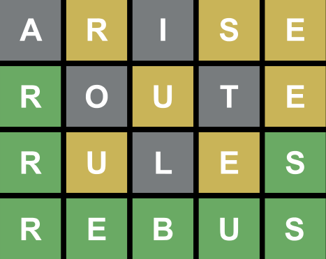

# Mordle

Mordle is a terminal-based [Wordle](https://www.nytimes.com/games/wordle/index.html) clone. In addition to being able to play the game, it can be used to help find game solutions by listing words that are compatible with one or more Wordle clues.

Mordle is written in C++ (C++20) and was developed as an excuse to play with CMake and the [{fmt}](https://fmt.dev/latest/index.html) formatting library. The code is platform agnostic and should run on anything that both CMake and fmt support. It's been tested on both Linux and Windows so far. I don't need this tool to solve my Wordle puzzles. :)

## Cloning and Building

```
# We're using fmt library as a submodule, so include --recurse-submodules option
git clone --recurse-submodules https://github.com/punk-floyd/mordle.git
cd mordle

# Out of source build
mkdir build
cd build

# Setup build environment
cmake ..

# Build the software
make
```

## Playing the Game

By default, running mordle will start a game with the secret word chosen from an interal list of ~2300 5-letter words. The game supports taking an external list of words to be used by the game, and it supports words of arbitrary length.

To provide an external word list, use the `--word-file` command line argument. The word list should be a text file with one word per line. Any word length is supported and all words in the word file must be the same length.

Apparently, the real Wordle game has two word lists: one containing possible solutions and another containing allowable guesses. At present, mordle supports a single word list for solutions and guesses, but it could be easily updated to support two lists.

By default, the game will use colorized output in a fashion similar to Wordle. The `--no-color` command line option will result in non-colored output and the word clues will be in the format described by the `HINT` item in the Finding Solutions section below.

## Finding Solutions

Mordle can be used to find possible game solutions by analyzing the word list against game hints. This is done by running the program with the `--hint` command line option.

It's used like this: `--hint WORD HINT`.
- `WORD` is a guessed word.
- `HINT` is a string encoding the resulting clue from the game when guessing `WORD`. The first character of the clue corresponds with the first character of the guessed word, and so on.
    - '`!`' means that the character is in the secret word and in the right spot (i.e., green)
    - '`~`' means that the character is in the secret word but in the wrong spot (i.e., yellow)
    - '`x`' means that the character is not in the secret word.

Consider an example:



The first hint would be encoded as:  `--hint arise x~x~~`.<br>
The second hint would be encoded as: `--hint route !x~x~`.<br>
The third hint would be encoded as:  `--hint rules !~x~!`.<br>

The more hints you provide on the command line, the more refined the output will be:

```
    $mordle --hint arise x~x~~ --hint route !x~x~ --hint rules !~x~!
    rebus
```

Note: The solution finder is only as good as the word list. The words in the internal word list were apparently pulled from the Wordle source code, but there's nothing stopping the Wordle overlords from modifying that list.

Another note: If you're running this in a bash terminal, you may want to wrap HINT in single quotes to prevent expansion of !! or ~ (e.g., `--hint earth '!!xx~'`).
